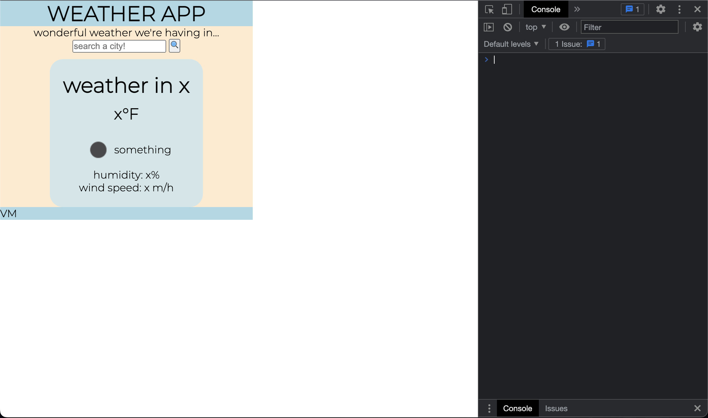
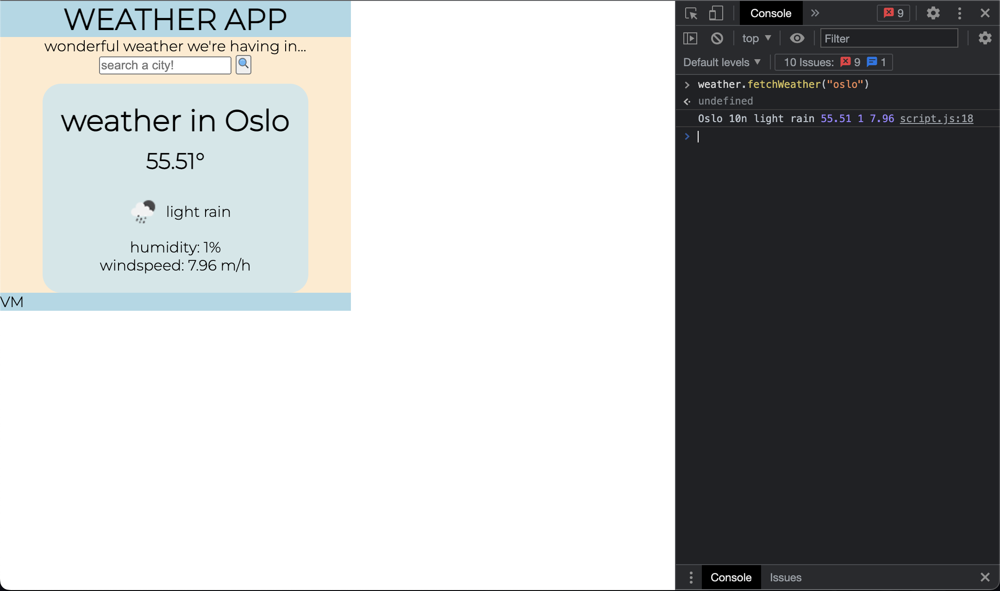
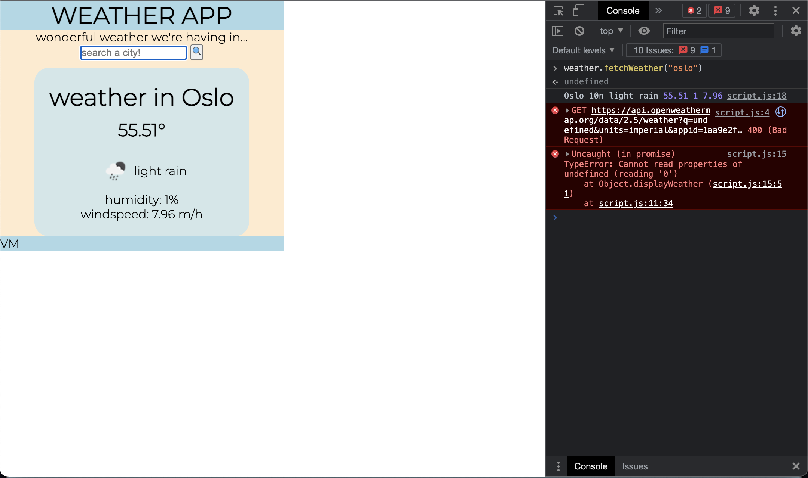

# weather-app
for module 6

## description

the point of the project geared me to create an application that can display the weather for a city a user were to visit or was just curious to see.
i built this project because i wanted to push myself to create an application i was actually content with in terms of my understanding and application of javascript and side API's, thus far. it should reduce the uncertainty over the current <and future> weather forecast for the searched city <for up to 5 days, while also saving previously searched cities>. through this process, i was able to gain a better understanding on the capacity web API's have to alter a user's experience, due to enabling more dynamic or engaging web applications.

## installation

n/a - the application is browser-only.

## usage

the purpose of this as it stands is to demonstrate input-based dynamism in the html to produce information to the user. unfortunately, this version is still only capable of utilizing the console for input, but will fetch the current weather information for the searched city(only- hope to figure out how to add the 5-day forecast, which is understood to be a requirement). below is the app as it currently stands and functions displayed...

i've consistently ran into the same error, an index/fetch one, but doubling back with the same set of eyes hasn't been helpful. i've highlighted them in the .JS file. i wasn't able to unblock myself on this part, but i did want to have a concerted display. i also am content with this progress with the consideration that i have not been able to take on this course by its traditional/chronological route and my grasp on each concept grows more with time invested. i am happy to have a little container that fetches and functions somewhat. and before you say make an appointment with a tutor, don't. these past 2-3 weeks have been tormenting. however, these upcoming weeks should be a bit more forgiving. i'll make an appointment with a tutor.

## credits
if it weren't for this guy:
https://www.youtube.com/watch?v=fffX2ge3wHs&t=425s
(simplilearn)

or this guy:
https://www.youtube.com/watch?v=WZNG8UomjSI&t=1496s
(jonah lawrence-dev pro tips)

she wouldn't be here:
victoria mota (VM)

## license
n/a
